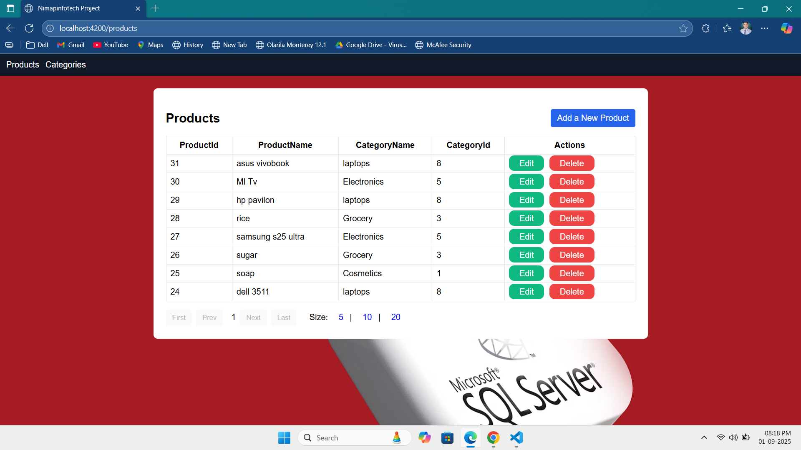
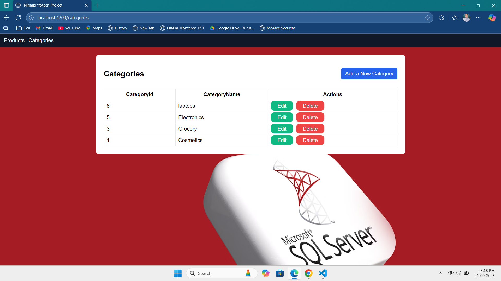

# Node js Project

This project is a **Full Stack CRUD Application** for managing **Products** and **Categories**. It includes a **Node.js + Express + MySQL backend** and an **Angular frontend**.

---

## 🚀 Features
- Add, update, delete, and view **Categories**.
- Add, update, delete, and view **Products**.
- Products linked to categories.
- Pagination support for products.
- REST API built with **Express.js**.
- MySQL database for persistent storage.

---

## 📂 Project Structure
```
project-root/
│── backend/        # Node.js + Express API with MySQL
│── frontend/       # Angular UI
│── README.md       # Documentation
```

---

## ⚙️ Backend Setup (Node.js + MySQL)
1. Navigate to backend folder:
   ```bash
   cd backend
   ```
2. Install dependencies:
   ```bash
   npm install
   ```
3. Create a **.env** file in backend root:
   ```env
   DB_HOST=localhost
   DB_USER=root
   DB_PASSWORD=1234
   DB_NAME=nodetest
   DB_PORT=3306
   PORT=3000
   ```
4. Run backend:
   ```bash
   npm start
   ```
   API will run on: `http://localhost:3000`

---

## 🖥️ Frontend Setup (Angular)
1. Navigate to frontend folder:
   ```bash
   cd frontend
   ```
2. Install dependencies:
   ```bash
   npm install
   ```
3. Start Angular app:
   ```bash
   npm start
   ```
   Angular app will run on: `http://localhost:4200`

---

## 🛠️ Database Setup
Run the following SQL queries in MySQL:

```sql
CREATE DATABASE nodetest;

USE nodetest;

CREATE TABLE Category (
  CategoryId INT AUTO_INCREMENT PRIMARY KEY,
  CategoryName VARCHAR(100) NOT NULL
);

CREATE TABLE Product (
  ProductId INT AUTO_INCREMENT PRIMARY KEY,
  ProductName VARCHAR(100) NOT NULL,
  CategoryId INT,
  FOREIGN KEY (CategoryId) REFERENCES Category(CategoryId)
);
```

---

## 📸 Screenshots

### 🛒 Products Page


### 📂 Categories Page


---

## 📌 Tech Stack
- **Frontend:** Angular, Bootstrap
- **Backend:** Node.js, Express.js
- **Database:** MySQL

---

## 📬 Author
👨‍💻 Developed by Yogesh Karemore

---

## 🔗 GitHub Repository
👉 https://github.com/yogeshkaremore3/Node-js-Machine-test-Nimap.git
